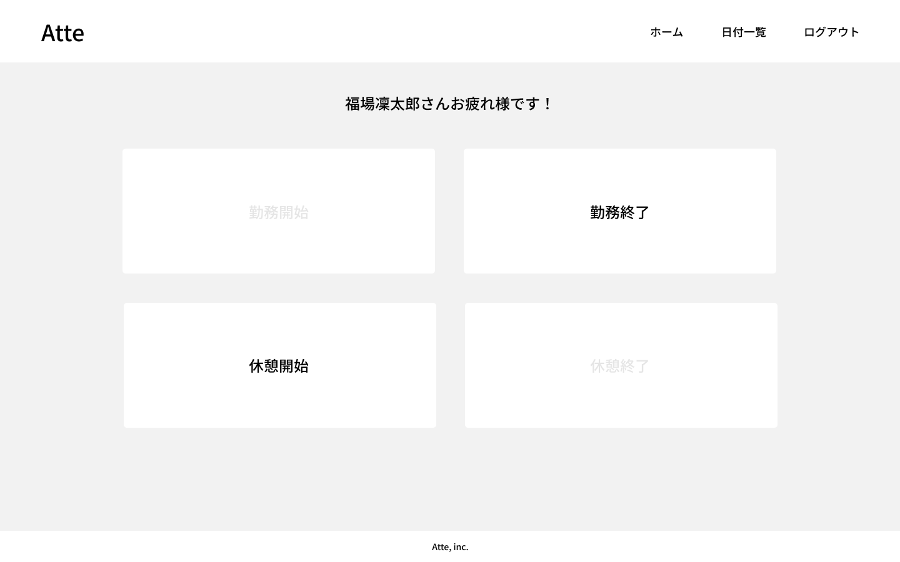
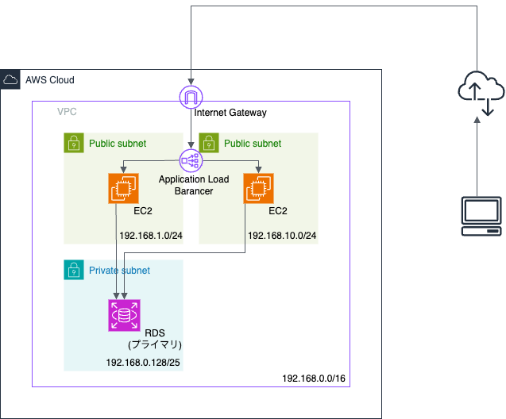
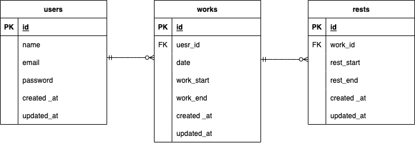

# Atte（勤怠管理システム）

勤怠管理システムを作成しました。  
ログイン後、ボタン押下で勤務開始/終了時間と休憩開始/終了時間を管理します。



## 作成した目的

学習のアウトプットとして作成

## アプリケーション URL

勤怠管理システム　　http://atte-web-lb-1252239849.ap-northeast-1.elb.amazonaws.com/login

## アーキテクチャ



## 機能一覧

- ログイン機能
- メール認証
- 勤務状態によるボタン制御
- 勤務時間/休憩時間管理
- 日付別勤怠管理
- ユーザー一覧
- ユーザー別勤怠管理

## 仕様技術

- PHP8.3.8
- Laravel8.83.27
- MySQL8.0.26
- Nginx
- Docker/Docker-compose
- AWS
  - VPC
  - EC2
  - RDS
  - S3

## テーブル設計


## ER 図



## 環境構築

**Docker ビルド**

1. `git@github.com:Shinji-0323/Atte.git`
2. DockerDesktop アプリを立ち上げる
3. `docker-compose up -d --build`

**Laravel 環境構築**

1. `docker-compose exec php bash`
2. `composer install`
3. 「.env.example」ファイルを 「.env」ファイルに命名を変更。または、新しく.env ファイルを作成
4. .env に以下の環境変数を追加

```text
DB_CONNECTION=mysql
DB_HOST=mysql
DB_PORT=3306
DB_DATABASE=laravel_db
DB_USERNAME=laravel_user
DB_PASSWORD=laravel_pass
```

5. アプリケーションキーの作成

```bash
php artisan key:generate
```

6. マイグレーションの実行

```bash
php artisan migrate
```

7. シーディングの実行

```bash
php artisan db:seed
```

## URL

- 開発環境：http://localhost/
- phpMyAdmin：http://localhost:8080/
- MailHog：http://localhost:8025/

